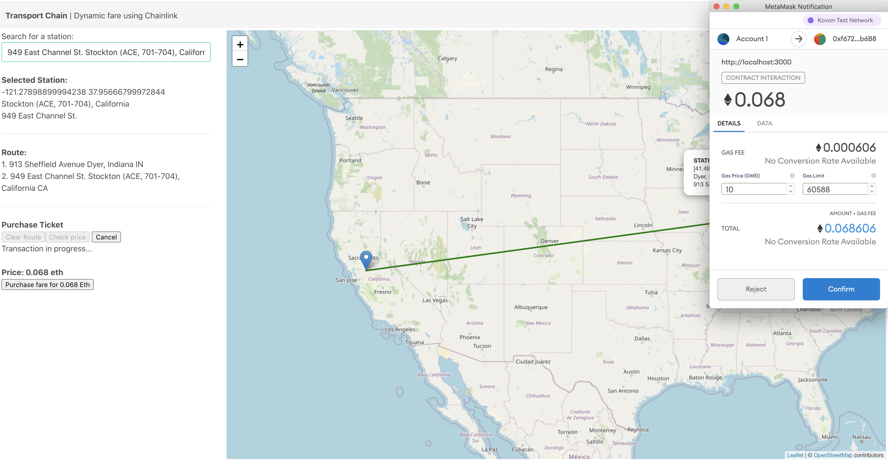

    

## FarePass

FarePass is a blockchain application that allows purchase of public transport passes based on volume present at different transport hubs and the number of passes previously purchased.

Used several different blockchain technologies to make this project, going after:

## Inspiration

Covid caused a huge drop in public service usage last year. As services reopen, the use of physical tickets

The ability to sell or retrade physical printed tickets is also difficult in many cases, especially across networks. With FarePass, two parties can trade a ticket. The owner of the ticket verifies their identity and pass ownership at the time of redemption.

## What it does

- Uses circle API for integrating USDC purchasing of tickets.
- Rarible NFT minting enables creating a 'virtual' ticket for the fare purchase.
- Determines the real-time price for a given transport contract.
- Creates a marketplace where tickets can be resold and traded.
- Generates a receipt representing your pass purchase.

     
    Collecting payment for a given route using metamask.

## How we built it

FarePass queries an index of train locations across the US allowing the user to create their own custom route for pass purchase.

Upon completing the purchase, the user is redirected to a receipt/completion page linking to the transaction alongside the created pass document as a pdf. Currently supports the Kovan network only.

- Metamask/web3 (contract interaction)
- Circle API (USDC payments)
- Rarible (Ticket NFT generation)

<!-- Demo: FarePass.netlify.com -->

## Challenges we ran into

### Running FarePass

FarePass requires the following env variables

<pre>

</pre>

## What's next for FarePass

- Support longer term passes
- More historic data to improve the pricing model
- Admin graphs/reporting of purchases made by users

## Screenshots

<!--
### Useful links
- https://betterprogramming.pub/how-to-connect-a-react-app-to-the-blockchain-fa9dbd0bbd69
-->
