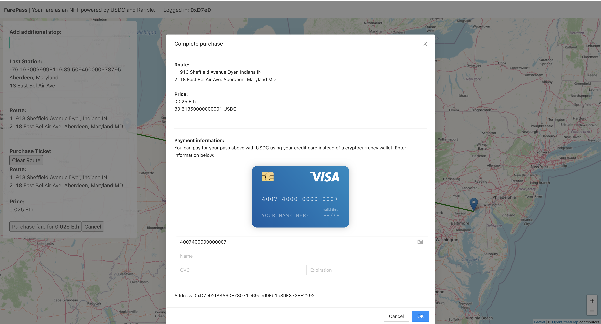
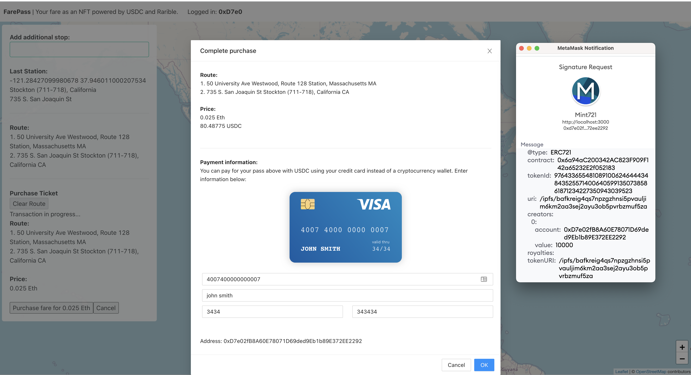
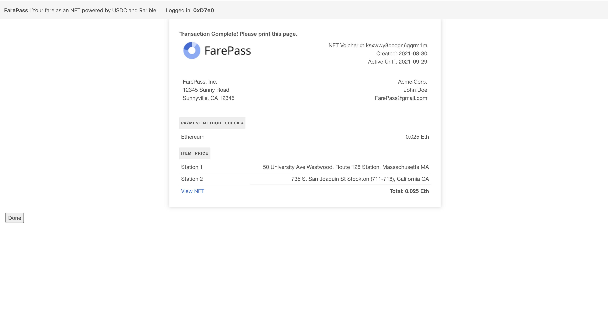
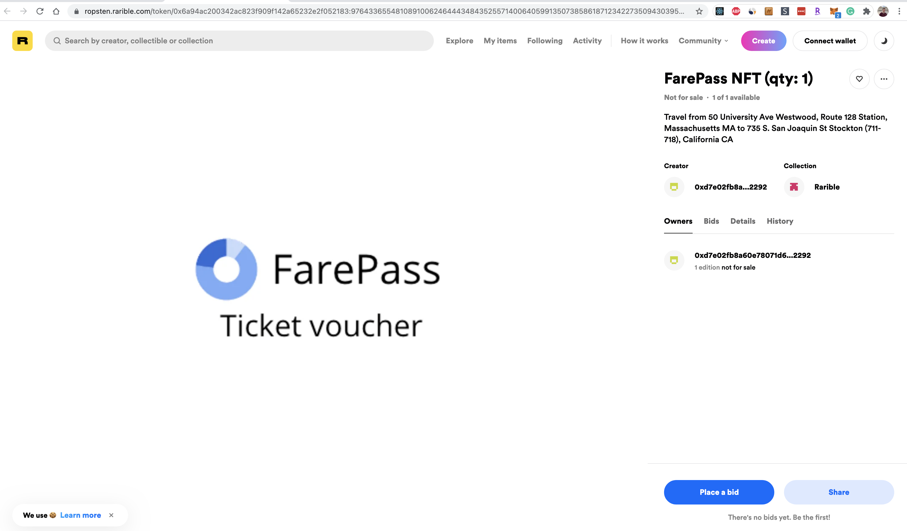

    

## FarePass

FarePass is a prototype blockchain application that allows the purchase of public transport passes as transferable and tradeable NFT's. FarePass leverages Circle APIs to enable payment for passes in USDC without requiring a wallet transfer. Once payment is accepted, a receipt and NFT are minted to represent the sale of the ticket or pass.

Pitch deck: https://docs.google.com/presentation/d/1cGmqOf55ByTKShMHQLazUSxSiJTtTT5OTCnxrSor1CQ/edit?usp=sharing

Note this project is still a prototype and would require additional work to go live.

Tested/demoed on ropsten network.

## How we built it

FarePass queries an index of train locations across the US allowing the user to create their own custom route for pass purchase.

Upon completing the purchase, the user is redirected to a receipt/completion page linking to the transaction alongside the created pass document as a pdf. Currently supports the Kovan network only.

- Metamask/web3 (contract interaction)
- Circle API (USDC payments)
- Rarible (Ticket NFT generation)

## Inspiration

Covid caused a huge drop in public service usage last year. As services reopen, the use of physical tickets

The ability to sell or retrade physical printed tickets is also difficult in many cases, especially across networks. With FarePass, two parties can trade a ticket. The owner of the ticket verifies their identity and pass ownership at the time of redemption.

## What it does

- Uses circle API for integrating USDC purchasing of tickets.
- Rarible NFT minting enables creating a 'virtual' ticket for the fare purchase.
- Determines the real-time price for a given transport contract.
- Creates a marketplace where tickets can be resold and traded.
- Generates a receipt representing your pass purchase.
- NFT can be presented by the owner at time of redemption / use.

### How to run

`yarn && yarn start`

For rarible interaction, requires browser with metamask connected to ropsten network. App should prompt for authorization.

### Screenshots

    
    
    
    
    

### Future work

- Obtain partnerships with companies willing to offer fare in the form of transferable NFT's.
- Launch mainnet
- Expand to other tickets like conferences
- Add QR cores that enable scanning at time of use

<!--
Demo flow:

TODO:
1. Add lazy mint of ticket at time of purchase.
2. Enable Circle API credit card payment with callback for mint of NFT.

-->
